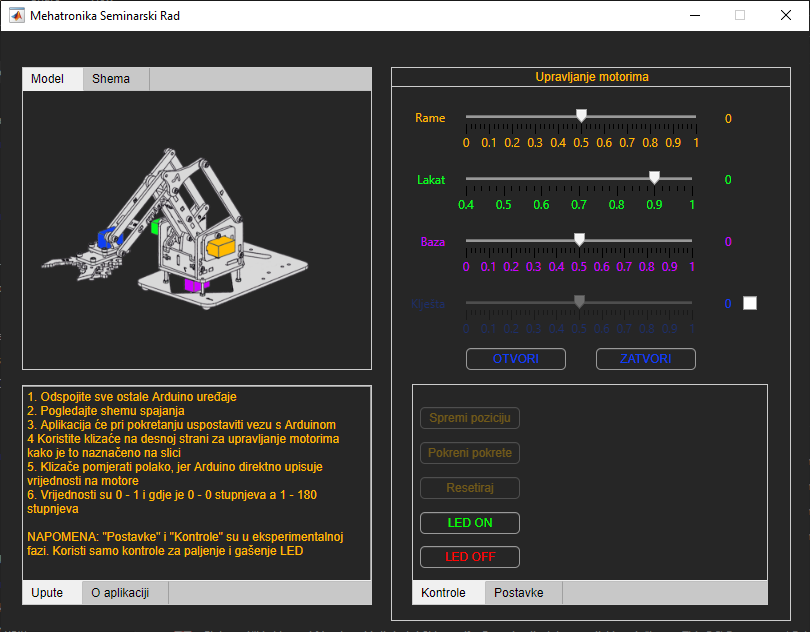

# Seminar-Mehatronika
## :warning: This is a legacy University project - DO NOT USE :warning:  
### :heavy_exclamation_mark: Repository is kept alive because it's referenced in an essay :heavy_exclamation_mark:  
Repozitorij za seminarski rad iz Mehatronike - tema : Robotski manipulator: mehatronički pristup  
Za zadnju funkcionalnu verziju pogledajte repozitoriju na [linku](https://github.com/soss-stem/mearm-control-station)  

